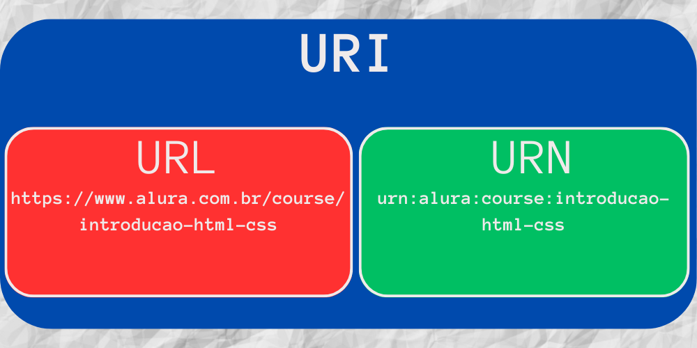
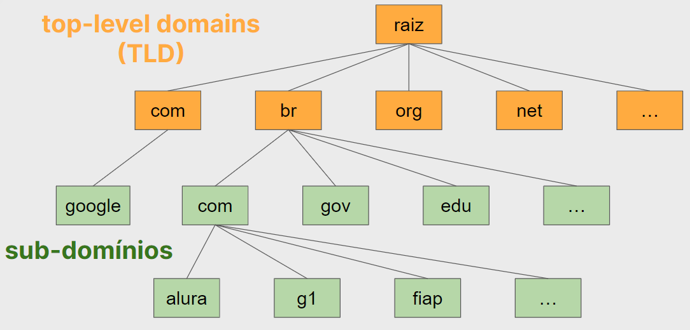

# Conhecendo o protocolo HTTP
O HTTP (HyperText Transfer Protocol) é um protocolo de comunicação que permite que aplicações web se comuniquem. Ele funciona como um protocolo de requisição-resposta no modelo cliente-servidor. O cliente faz uma requisição para o servidor e o servidor responde essa requisição. O HTTP é um protocolo *stateless*, ou seja, não guarda estado entre requisições. Isso significa que cada requisição que o cliente faz para o servidor, é independente das outras requisições. O servidor não sabe se o cliente fez uma requisição antes ou não.

## Conhecendo a arquitetura do HTTP
O HTTP é um protocolo que funciona em camadas. A camada mais baixa é a camada de transporte, que é responsável por transportar os dados entre o cliente e o servidor. O HTTP está na camada de aplicação, ou seja, roda sobre o protocolo de transporte TCP/IP. O HTTP é um protocolo de texto, ou seja, as mensagens são legíveis por humanos. Isso facilita o entendimento e a depuração de problemas.

**O que seria um protocolo?**
Para responder a essa pergunta, usaremos uma analogia: um protocolo é como se fosse uma conversa. Se o nosso navegador pudesse enviar mensagens de WhatsApp para o servidor, a conversa entre eles seria como abaixo:

```
Navegador: Olá, servidor! poderia me enviar a página inicial do seu site?
Servidor: Aqui está! (<html>...</html>)
Navegador: Obrigado! Agora, poderia me enviar o javascript da página?
Servidor: Aqui está! (<script>...</script>)
```

Como vemos, um servidor não é necessariamente um backend. Um frontend pode ser interpretado como um servidor, pois ele recebe requisições e envia respostas, disponibilizando recursos para o cliente, como o HTML, CSS, JavaScript, imagens, etc.

### Regras do protocolo HTTP
A primeira regra é que sempre deve haver duas entidades dialogando, sempre um cliente e um servidor.

Essa conversa é sempre iniciada pelo cliente. É o cliente quem pedirá o HTML, por exemplo, e não o contrário. O servidor não decidirá enviar informações ao cliente por conta própria.

Após a requisição do cliente, o servidor envia uma resposta com o que foi solicitado. O protocolo HTTP é baseado em mensagens de texto que seguem uma estrutura específica. Esse texto pode ser lido tanto por pessoas quanto por máquinas.

Por fim, temos uma camada sobre a qual o HTTP roda, ou seja, o Transmission Control Protocol - TCP. Essa é a camada de transporte, relevante para garantirmos que as mensagens HTTP chegarão ao seu destino com sucesso. Com isso, nenhuma das duas entidades ficará sem resposta.

Dentro desse contexto de comunicação, o cliente pode ser qualquer aplicação que faça requisições HTTP, como um navegador, um aplicativo mobile, um software de linha de comando, etc. O servidor pode ser qualquer aplicação que responda a essas requisições, como um servidor web, um servidor de arquivos, um servidor de imagens, etc.

## Peer-To-Peer
Você já usou torrent para baixar algum arquivo na internet? Caso sim, aproveitou um outro modelo de comunicação, o P2P ou Peer-To-Peer!

O modelo Cliente-Servidor não é o único modelo de comunicação na rede, nem sempre o mais adequado. Por exemplo, imagine que precisemos contar as letras de 20 palavras. No caso do modelo Cliente-Servidor, quem fará esse trabalho é o servidor, certo? E se precisar contar as letras de 1 milhão de palavras? Muito trabalhoso para o servidor, não?

O modelo Cliente-Servidor tenta centralizar o trabalho no servidor, mas isso também pode gerar gargalos. Se cada Cliente pudesse ajudar no trabalho, ou seja, assumir um pouco da responsabilidade do servidor, seria muito mais rápido. Essa é a ideia do P2P! Não há mais uma clara divisão entre Cliente-Servidor, cada cliente também é servidor e vice-versa!

Isto é útil quando você precisa distribuir um trabalho ou necessita baixar algo de vários lugares diferentes. Faz sentido?

Usando algum aplicativo de Torrent, o protocolo utilizado não é o HTTP, e sim o protocolo P2P, como BitTorrent ou Gnutella.

## Outros protocolos
O HTTP é o protocolo mais utilizado na internet, mas não é o único. Existem outros protocolos que também são muito utilizados, como o P2P, FTP, SMTP, POP3, IMAP, etc. Cada um desses protocolos é utilizado para um propósito diferente. O HTTP é utilizado para transferir arquivos, o FTP é utilizado para transferir arquivos também, mas com mais recursos, como autenticação, por exemplo. O SMTP é utilizado para enviar e-mails, o POP3 e o IMAP são utilizados para receber e-mails.

# Aprendendo sobre URLs
A seguir, veremos como funciona uma URL, que é a forma como acessamos um recurso na web. Por exemplo, quando acessamos o site da Alura, digitamos a URL https://www.alura.com.br. Essa URL é composta por vários elementos, que veremos a seguir.

## Entendendo a estrutura de uma URL
Uma URL (Uniform Resource Locator), por exemplo, http://localhost:3000/ é composta por vários elementos:
- `http://` é o protocolo utilizado para acessar o recurso. Nesse caso, o protocolo é o HTTP, mas poderia ser o HTTPS, FTP, etc.
- `localhost` é o domínio do recurso. Nesse caso, o domínio é `localhost`, mas poderia ser www.alura.com.br, www.google.com, etc.
- `:3000` é a porta utilizada para acessar o recurso. Nesse caso, a porta é 3000.
- `/` é o caminho do recurso. Nesse caso, o caminho é a raiz do site.

## URI ou URL?
Muitas vezes, desenvolvedores usam a sigla URI (Uniform Resource Identifier) quando falam de endereços na web. Alguns preferem URL (Uniform Resource Locator), e alguns misturam as duas siglas à vontade. Há uma certa confusão no mercado a respeito e mesmo desenvolvedores experientes não sabem explicar a diferença. Então, qual é a diferença?

- **Resposta 1 (fácil)**: Uma URL é uma URI. No contexto do desenvolvimento web, ambas as siglas são válidas para falar de endereços na web. As siglas são praticamente sinônimos e são utilizadas dessa forma.

- **Resposta 2 (mais elaborada)**: Uma URL é uma URI, mas nem todas as URI's são URL's! Existem URI's que identificam um recurso sem definir o endereço, nem o protocolo. Em outras palavras, uma URL representa uma identificação de um recurso (URI) através do endereço, mas nem todas as identificações são URL's.

Existe um outro padrão que se chama URN (Uniform Resource Name). Os URN's também são URI's! Um URN segue também uma sintaxe bem definida, algo assim **urn:cursos:alura:course:introducao-html-css**. Repare que criamos uma outra identificação do curso Introdução ao HTML e CSS da Alura, mas essa identificação não é um endereço. 


## Acessando diferentes portas
Quando acessamos um site, geralmente não precisamos informar a porta utilizada. Por exemplo, quando acessamos o site da Alura, digitamos a URL https://www.alura.com.br. Nesse caso, não precisamos informar a porta utilizada, pois o navegador já sabe que a porta padrão para o protocolo HTTP é a porta 80. Poderíamos acessar o site da Alura informando a porta, como http://www.alura.com.br:80, mas não é necessário.

Dentre as portas padrões, podemos citar:
- HTTP: 80
- HTTPS: 443
- Livres para uso: de 1023 até 65535

Portas entre 0 e 1023 são reservadas para serviços padronizados.

## Entendendo domínios
Acessando a nossa aplicação pelo navegador no endereço `localhost:3000`, temos o nosso servidor como sendo o `localhost` (nome de domínio de onde estamos acessando o servidor) e a porta `3000`.

O site `google.com` é outro nome de domínio, que conseguimos acessar de forma direta sem a necessidade de informar a porta (por ser padrão), no entanto, podemos utilizar o IP:
```
http://142.251.128.14
```

Que nos leva a `google.com`.

**DNS**
O DNS (Domain Name System) é um sistema de gerenciamento de nomes de domínios. Ele é responsável por traduzir um nome de domínio para um endereço IP. Por exemplo, quando acessamos o site da Alura, digitamos a URL https://www.alura.com.br. O DNS é responsável por traduzir o nome de domínio www.alura.com.br para o endereço IP.

Na web, cada site, ou sistema, ou empresa possui seu próprio domínio, sendo onde tudo é controlado. Por exemplo, todos os sistemas da Alura estão sobre o domínio de alura.com.br. Há domínios globais e domínios locais (localhost).

Um servidor DNS é uma arvore hierárquica de nomes de domínio, pois este tipo de estrutura permite que os nomes de domínio sejam organizados de forma a facilitar a sua administração. Por exemplo, o domínio:
- `www.alura.com.br` é um subdomínio do domínio `alura.com.br`	
	- `alura.com.br` é um subdomínio do domínio `com.br`
		- `com.br` é um subdomínio do domínio `br`

Quando acessamos algo `.com.br` ou `.org`, significa que são o primeiro nível dos nomes dos sites. Inicia-se da raiz (nível mais abstrato) que é para ter um ponto de onde começar, e a partir disso vamos descendo os níveis. Chamamos esse nível de top-level domains (TLD) (em português, "domínios de nível superior").


# Inspecionando o protocolo HTTP
A seguir, veremos como inspecionar o protocolo HTTP, para entendermos melhor como ele funciona.

## Modo hacker
Para entender melhor a estrutura do HTTP, usaremos a ferramenta `telnet` para realizar requisições em baixo nível, conectando via TCP com servidores (de sistema ou servidor). Para isso, com a ferramenta instalada e front/back rodando, abra o terminal e digite:

```
telnet localhost 3000
```

Onde `localhost` é o domínio e `3000` é a porta. Após isso, digite:

```
GET / HTTP/1.1 
(enter 2x)
```

Onde `GET` é o método, `/` é o caminho e `HTTP/1.1` é a versão do protocolo. Após isso, o servidor irá responder com o HTML da página inicial.

Para um exemplo de POST, faremos o login no sistema. Para isso, digite:

```
POST /public/login HTTP/1.1
Content-Type: application/json
Content-length: 45

{"email": "geo@alura.com.br", "senha": "123"}
```

Obtendo a resposta:

```
HTTP/1.1 200 OK
X-Powered-By: Express
Vary: Origin, Accept-Encoding
(...)
Content-Type: application/json
Content-Length: 364

{
    "access_token: "eyJhiJ...WCbZof2rf",
    (...)
}
```

Noque que as mensagens HTTP tem esse formato de **texto** específico com detalhes da requisição, cabeçalhos e corpo, tanto para requisições quanto para respostas.

## Depurando métodos HTTP
Resumidamente, temos os seguintes métodos HTTP, popularmente conhecidos como verbos CRUD:
- **GET**: obter um recurso
- **POST**: criar um recurso
- **PUT**: atualizar um recurso
- **DELETE**: remover um recurso
- **PATCH**: atualizar parcialmente um recurso

### PUT e PATCH
A diferença entre PUT e PATCH é que o PUT é utilizado para atualizar um recurso por completo, enquanto o PATCH é utilizado para atualizar parcialmente um recurso. Por exemplo, se temos um recurso com os campos `nome` e `email`, e queremos atualizar apenas o campo `nome`, devemos utilizar o PATCH. Se quisermos atualizar os campos `nome` e `email`, devemos utilizar o PUT.

## Cabeçalhos e autenticação
Os servidores HTTP são stateless. Em outras palavras, os servidores HTTP não guardam estados, portanto não se lembram do aconteceu em requisições anteriores. No caso, ele não lembra que já havia nos autenticado no sistema.

A implicação é que precisamos continuamente comprovar ao servidor quem somos e que já fomos autenticados.

Podemos fazer isso de duas formas, com o uso de **cookies** ou com o uso de **sessões**. 

### Sessões
Como o nome sugere, uma sessão é um período de tempo em que o cliente mantém uma conexão com o servidor, por meio de recursos como session storage ou local storage.

Após signup ou login, o servidor nos envia um token, que é um código que comprova que já fomos autenticados. Esse token é enviado no cabeçalho da requisição, no campo `Authorization`. A estrutura do cabeçalho é de um objeto, isto é, chave e valor:

```
{
    "Authorization": "Bearer <token>"
}
```

Repare que o token é precedido pela palavra `Bearer`. Essa palavra é utilizada para indicar que o token é um token de acesso. Existem outros tipos de tokens, como o token de atualização, por exemplo.

### Cookies
Um cookie é um pequeno arquivo de texto, normalmente criado pela aplicação web, para guardar algumas informações sobre o usuário no navegador. Quais são essas informações depende um pouco da aplicação. Pode ser que fique gravado alguma preferência do usuário, informações sobre as compras na loja virtual ou a identificação do usuário. Isso depende da utilidade para a aplicação web.

## Depurando os códigos resposta HTTP
Por ser um protocolo, o HTTP segue algumas regras, no caso, o [RFC 7231](https://www.rfc-editor.org/rfc/rfc7231). Neste documento, podemos encontrar os códigos de resposta HTTP divididos em 5 classes:
- **1xx**: Informativo
- **2xx**: Sucesso
- **3xx**: Redirecionamento
- **4xx**: Erro cometido pelo cliente
- **5xx**: Erro cometido pelo servidor
- 
# Protegendo nossa aplicação com HTTPS
Ao utilizar o HTTP, as informações trafegam entre o cliente e o servidor sem criptografia. Isso significa que qualquer pessoa mal intencionada pode interceptar essas informações e roubar dados sensíveis, como senhas, por exemplo. Para evitar esse tipo de problema, utilizamos o HTTPS.

Para migrar nossa aplicação para HTTPS, precisamos de um certificado SSL e uma chave privada. O certificado SSL é um arquivo que contém informações sobre a nossa aplicação, como o nome do domínio, por exemplo. A chave é utilizada para criptografar as informações que trafegam entre o cliente e o servidor.

Para fins de desenvolvimento, podemos utilizar o pacote `openssl` para gerar um certificado e uma chave privada. Para isso, basta executar o comando abaixo:

```
openssl req -x509 -sha256 -nodes -days 365 -newkey rsa:4096 -keyout key.key -out cert.crt
```

Esse comando irá gerar um certificado e uma chave privada válidos por 365 dias. Após executar esse comando, teremos dois arquivos: `cert.crt` e `key.key`.

Em sistemas servidores, importamos o módulo responsável por lidar com o HTTPS, e passamos o certificado e a chave privada como parâmetro. Por exemplo, no Node.js, podemos fazer isso com o seguinte código:

```js
const https = require('https');
const fs = require('fs');

//...

const cert = fs.readFileSync('cert.crt');
const key = fs.readFileSync('key.key');

https.createServer({ cert, key }, app).listen(3000, () => {
  console.log('Servidor HTTPS rodando na porta 3000');
});
```
## Entendendo certificados e chaves privadas
Fazendo uma analogia, podemos dizer que o certificado SSL é como se fosse o RG da nossa aplicação, a identidade utilizada para entrar na empresa na qual trabalhamos, por exemplo. A chave privada é como se fosse a chave do nosso escritório, a qual nunca compartilhamos ou fazemos cópias.

Podemos analisar o conteúdo do certificado e da chave privada com o comando abaixo:

```
openssl x509 -in cert.crt -text -noout
```

```
openssl rsa -in key.key -text 
```

Durante uma requisição HTTPS, o cliente envia uma mensagem para o servidor, solicitando o certificado SSL. O servidor envia o certificado SSL para o cliente. O cliente verifica se o certificado SSL é válido. Se for válido, o cliente gera uma **chave de sessão** e criptografa essa chave com a chave pública contida no certificado, e envia para o servidor. O servidor descriptografa essa chave com a chave privada e envia a chave de sessão para o cliente. A partir desse momento, o cliente e o servidor utilizam a chave de sessão para criptografar e descriptografar as informações que trafegam entre eles.

Essas idas e vindas de mensagens entre o cliente e o servidor são chamadas de **handshake**. O handshake é um processo que ocorre sempre que o cliente e o servidor precisam estabelecer uma conexão segura.

## Para saber mais: as chaves do HTTPS
O HTTPS usa uma chave pública e uma chave privada. As chaves estão **ligadas matematicamente**, <u>o que foi cifrado pela chave pública só pode ser decifrado pela chave privada</u>. Isso garante que os dados cifrados pelo navegador (chave pública) só podem ser lidos pelo servidor (chave privada). Como temos duas chaves diferentes envolvidas, esse método de criptografia é chamado de **criptografia assimétrica**. No entanto, a criptografia assimétrica tem um problema, ela é **lenta**.

Por outro lado, temos a **criptografia simétrica**, que usa a mesma chave para cifrar e decifrar os dados, como na vida real, onde usamos a mesma chave para abrir e fechar a porta. A criptografia simétrica é muito mais rápida.

Agora, o interessante é que o HTTPS usa ambos os métodos de criptografia, assimétrica e simétrica.

No certificado, vem a chave pública para o cliente utilizar, certo? E o servidor continua na posse da chave privada, ok? Isso é seguro, mas lento e por isso o cliente gera uma chave simétrica ao vivo (**chave de sessão**). Uma chave só para ele e o servidor com o qual está se comunicando naquele momento. Essa chave exclusiva (e simétrica) é então enviada para o servidor utilizando a criptografia assimétrica (chave privada e pública) e então é utilizada para o restante da comunicação.

Então, HTTPS começa com criptografia assimétrica para depois mudar para criptografia simétrica. Essa chave simétrica será gerada no início da comunicação e será reaproveitada nas requisições seguintes.

# Controlando o HTTP
A seguir, veremos como controlar o HTTP, para que possamos utilizar o protocolo da melhor forma possível.

## Para saber mais: enviando mais de um parâmetro via GET
Podemos utilizar as query strings para enviar parâmetros em uma URL, por exemplo fazendo da seguinte forma: `http://localhost/livros?categoria=3`. Mas e se além da categoria, também quiséssemos filtrar pelo autor? Nesse caso, faríamos assim: `/livros?categoria=3&autor=1`. Ou seja, utilizamos o caractere `&` para separar os nomes dos parâmetros que configuramos.

Pensando agora em outro exemplo, mais complexo, poderíamos ter a seguinte URL:

```
http://eletronicos.com/products?search=TV&maxPrice=1000&brand=ACME&model=XPTO&delivery=free&
```

O interessante de ter os parâmetros na URL, é que além de ficar óbvio que o request é um GET, fica fácil para o usuário compartilhar a busca que ele fez, diferente do POST, ou qualquer outro método onde os parâmetros vão no corpo.

A especificação do HTTP não define um número máximo de parâmetros para uma URL, e nem mesmo um tamanho máximo para a URL (conforme a seção 3.2.1 da [RFC 2616](https://www.ietf.org/rfc/rfc2616.txt)). Por isso, cada navegador e servidor pode implementar o seu próprio limite máximo, embora haja uma convenção de suportar até 2000 caracteres. Portanto, quando estiver criando seus requests, caso eles estejam muito grandes, considere convertê-los para um POST, ou talvez refatorar as URLs para simplificar o envio de parâmetros.

## Para saber mais: parâmetros na URL
Se desejarmos, por exemplo, exibir um produto específico, podemos fazer isso utilizando um parâmetro query `id`, por exemplo: 

```
http://localhost:3000/produtos?id=1
```

No entanto, podemos utilizar um parâmetro de rota. Por exemplo:

```
http://localhost:3000/produtos/1
```

Para isso, precisamos definir a rota da seguinte forma:

```js
app.get('/produtos/:id', (req, res) => {
  const { id } = req.params;
  //...
});
```

Ou seja, definimos que após a rota `/produtos/`, esperamos por uma informação que representa o `id` do produto.

## Configurando o formato dos dados
Ao receber a resposta do servidor, podemos identificar o formato dos dados através do cabeçalho `Content-Type`. Por exemplo, se o servidor enviar um JSON, o cabeçalho `Content-Type` será `application/json`. Se o servidor enviar um HTML, o cabeçalho `Content-Type` será `text/html`.

Para especificar um formato de dados, podemos utilizar o cabeçalho `Accept`. 

## Resolvendo algumas limitações do HTTP
Tanto o HTTP/1.1 quanto o HTTP/2 trabalham em cima do TCP.

As maiores diferenças entre esses dois protocolos é que o primeiro deixa a desejar as requisições sequenciais, ou seja, cada vez que fazemos um REQUEST, temos que esperar terminar para começar o outro no contexto de uma conexão TCP, que é o canal por onde as mensagens passam.

Conseguiremos verificar isso pelo DevTools do Chrome, na aba Network, onde podemos ver o tempo de cada requisição.

O HTTP/2, por sua vez, permite que as requisições sejam feitas em paralelo, o que melhora muito a performance. Isso é possível porque o HTTP/2 trabalha com o conceito de multiplexação, que é a capacidade de enviar várias requisições ao mesmo tempo e juntá-las em uma mesma conexão TCP.

Para isso, devemos habilitar o HTTP/2 tanto no servidor quanto no cliente. 

Além disso, o HTTP/2 possui o mecanismo de **compactação de cabeçalho**, em que o que era legível em formato de texto passa por um algoritmo de compressão e se torna um cabeçalho binário que pode ser enviado pela rede e economizar recursos. Podemos reparar isso observando o cabeçalho, que possui as chaves em minúsculo, por exemplo.

Outro recurso interessante do HTTP/2 é o **server push**, que permite que o servidor envie recursos para o cliente antes mesmo que ele solicite. Por exemplo, se o servidor enviar um HTML para o cliente, e esse HTML faz referência a um arquivo CSS, o servidor pode enviar esse arquivo CSS para o cliente antes mesmo que ele solicite.

## Conhecendo o HTTP3
O HTTP/3 é a nova versão do protocolo HTTP, que está em desenvolvimento. O HTTP/3 trabalha em cima do QUIC, uma implementação do UDP, que é um protocolo de transporte mais leve que o TCP. O HTTP/3 também possui o mecanismo de multiplexação, compactação de cabeçalho e server push.

Para criar uma conexão segura com o HTTP/1.1 ou HTTP/2, passamos pelas etapas de comunicação TCP, TLS e, por fim, HTTP (requisições HTTPS). No HTTP/3, passamos pelas etapas de comunicação UDP, TLS e, por fim, HTTP (requisições HTTPS). O HTTP/3 faz uso do QUIC, que tem embutido o TLS, o que torna a comunicação mais rápida, isto é, menos etapas.